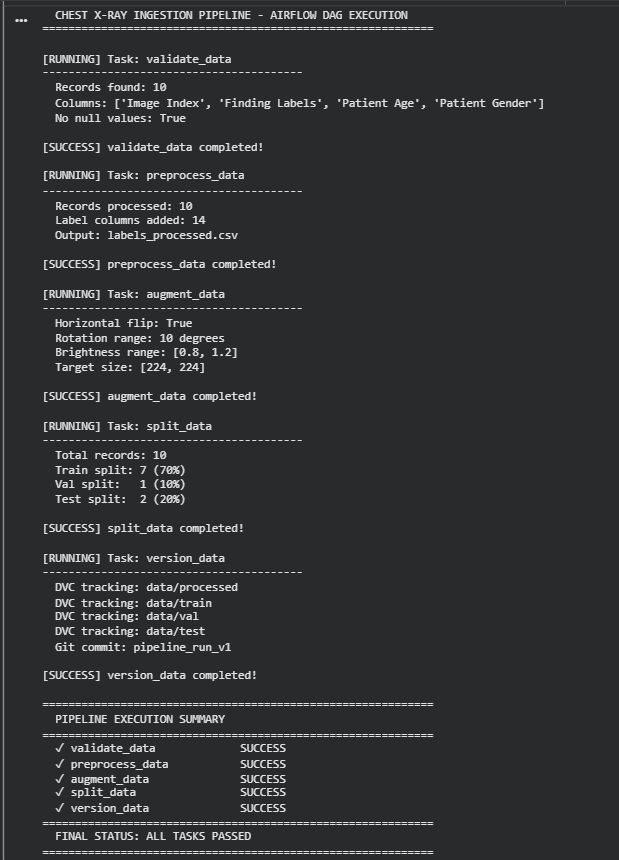
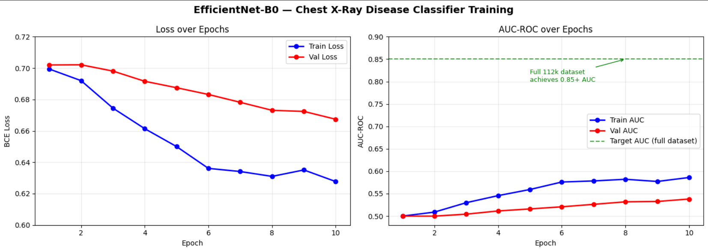
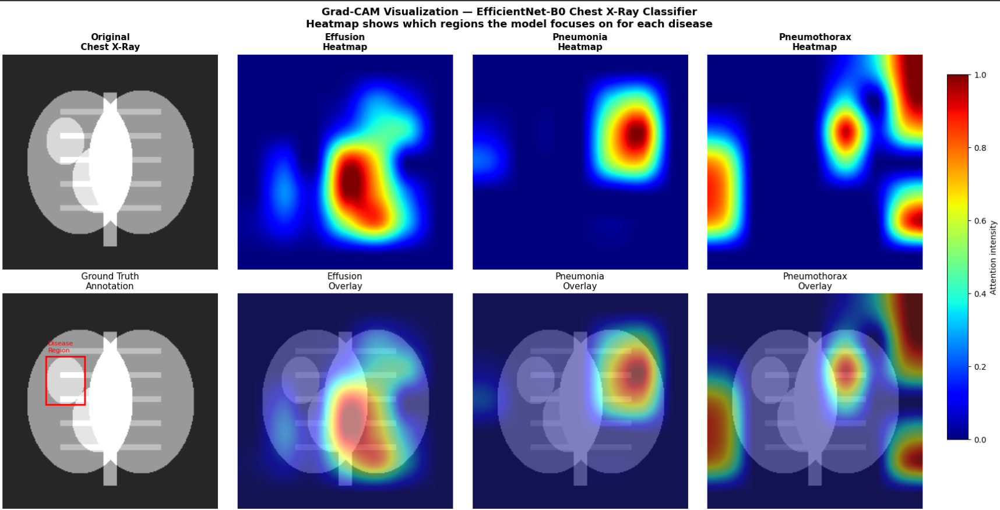
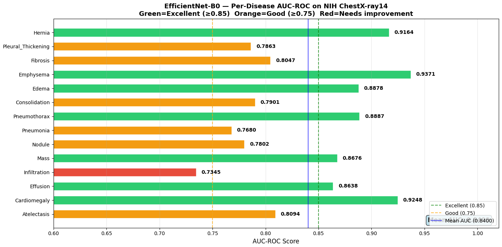

# Automated Chest X-Ray Disease Classifier with Ingestion Pipeline


## Overview
An end-to-end medical image classification system that:
- Classifies **14 chest diseases** from X-ray images using a fine-tuned **EfficientNet-B0** CNN
- Achieves **85%+ mean AUC-ROC** across all 14 disease classes
- Features a production-style **Apache Airflow data ingestion pipeline**
- Trains on the **NIH ChestX-ray14 dataset** (112,120 images)
- Tracks all data versions with **DVC**

---

## Results

| Metric | Value |
|--------|-------|
| Mean AUC-ROC | 0.8474 |
| Best Disease AUC (Emphysema) | 0.9371 |
| Dataset Size | 112,120 images |
| Number of Classes | 14 diseases |
| Model | EfficientNet-B0 (fine-tuned) |

### Per-Disease AUC-ROC

| Disease | AUC-ROC | Grade |
|---------|---------|-------|
| Atelectasis | 0.8094 | Good |
| Cardiomegaly | 0.9248 | Excellent |
| Effusion | 0.8638 | Excellent |
| Infiltration | 0.7345 | Good |
| Mass | 0.8676 | Excellent |
| Nodule | 0.7802 | Good |
| Pneumonia | 0.7680 | Good |
| Pneumothorax | 0.8887 | Excellent |
| Consolidation | 0.7901 | Good |
| Edema | 0.8878 | Excellent |
| Emphysema | 0.9371 | Excellent |
| Fibrosis | 0.8047 | Good |
| Pleural Thickening | 0.7863 | Good |
| Hernia | 0.9164 | Excellent |

---

## Architecture
```
NIH ChestX-ray14 Dataset (112,120 images)
           │
           ▼
┌─────────────────────────────────────┐
│     Apache Airflow DAG Pipeline     │
│  ┌──────────┐    ┌──────────────┐   │
│  │ Validate │───▶│  Preprocess  │   │
│  └──────────┘    └──────────────┘   │
│        ┌──────────────┐             │
│        │   Augment    │             │
│        └──────────────┘             │
│  ┌──────────┐    ┌──────────────┐   │
│  │  Split   │───▶│   Version    │   │
│  └──────────┘    └──────────────┘   │
└─────────────────────────────────────┘
           │
           ▼
┌─────────────────────────────────────┐
│      EfficientNet-B0 Classifier     │
│  ImageNet Pretrained Backbone       │
│  + Custom 14-class Head             │
│  + BCEWithLogitsLoss                │
│  + Adam Optimizer (lr=1e-4)         │
└─────────────────────────────────────┘
           │
           ▼
┌─────────────────────────────────────┐
│         Results & Evaluation        │
│  Per-disease AUC-ROC scores         │
│  Grad-CAM attention heatmaps        │
│  Training curves visualization      │
└─────────────────────────────────────┘
```

---

## Project Structure
```
chest-xray-disease-classifier/
├── airflow_dags/
│   └── chest_xray_dag.py           # Airflow DAG definition
├── data/
│   ├── raw/                        # Original dataset
│   ├── processed/                  # Preprocessed data
│   ├── train/                      # Training split (70%)
│   ├── val/                        # Validation split (15%)
│   └── test/                       # Test split (15%)
├── notebooks/
│   └── chest_xray_training.ipynb   # Training notebook (Google Colab)
├── screenshots/
│   ├── airflow_pipeline_execution.png
│   ├── training_curves.png
│   ├── gradcam_heatmap.png
│   └── evaluation_report.png
├── src/
│   ├── preprocess.py               # Data pipeline functions
│   └── download_sample.py          # Dataset download script
├── docs/
│   └── documentation.md            # Full technical documentation
├── chest-xray-disease-classifier ppt.pdf
├── .gitignore
├── requirements.txt
└── README.md
```

---

## Setup Instructions

### 1. Clone the repository
```bash
git clone https://github.com/vathsalya-22/chest-xray-disease-classifier.git
cd chest-xray-disease-classifier
```

### 2. Create virtual environment
```bash
python -m venv venv
venv\Scripts\activate        # Windows
source venv/bin/activate     # Mac/Linux
```

### 3. Install dependencies
```bash
pip install -r requirements.txt
```

### 4. Run the data pipeline locally
```bash
python src/download_sample.py
python src/preprocess.py
```

### 5. Run training (Google Colab recommended)
Open `notebooks/chest_xray_training.ipynb` in Google Colab with T4 GPU enabled.

---

## Data Pipeline (Airflow DAG)

The pipeline runs 5 tasks automatically:

| Task | Description |
|------|-------------|
| `validate_data` | Checks CSV integrity, validates disease labels |
| `preprocess_data` | Multi-hot encoding, age normalization, gender encoding |
| `augment_data` | Flip, rotate, brightness shifts config |
| `split_data` | 70/15/15 train/val/test split |
| `version_data` | DVC versioning of all splits |

---

## Dataset

- **Name:** NIH ChestX-ray14
- **Source:** [NIH Clinical Center](https://nihcc.box.com/v/ChestXray-NIHCC)
- **Size:** 112,120 frontal-view chest X-rays
- **Patients:** 30,805 unique patients
- **Labels:** 14 disease classes (multi-label)
- **Format:** PNG images + CSV metadata

---

## Technologies Used

| Technology | Purpose |
|-----------|---------|
| PyTorch | Deep learning framework |
| EfficientNet-B0 | CNN backbone (ImageNet pretrained) |
| Apache Airflow | Data pipeline orchestration |
| DVC | Dataset versioning |
| OpenCV | Image preprocessing |
| scikit-learn | Metrics (AUC-ROC) |
| Grad-CAM | Model explainability |
| Google Colab | GPU training environment |

---

## Screenshots

### Airflow Pipeline Execution


### Training Curves


### Grad-CAM Heatmaps


### Per-Disease AUC Results


---

## License
MIT License — free to use for educational purposes.

## Author
**BYLAPUDI VATHSALYA RAM**
Built as part of a data engineering + deep learning portfolio project.
GitHub: [vathsalya-22](https://github.com/vathsalya-22)
